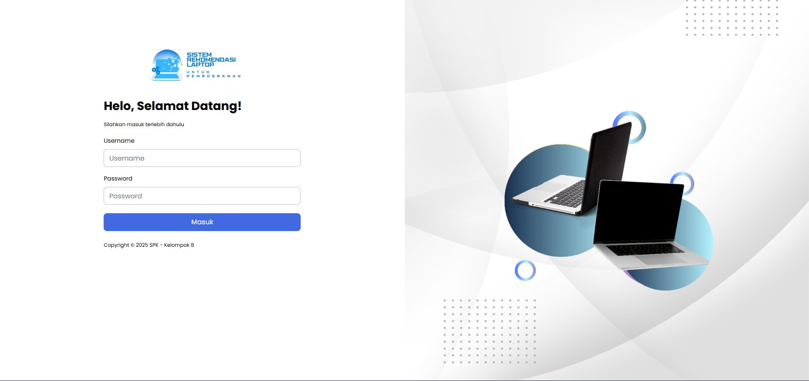
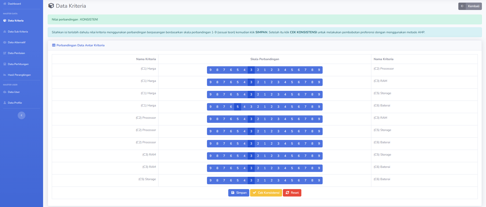
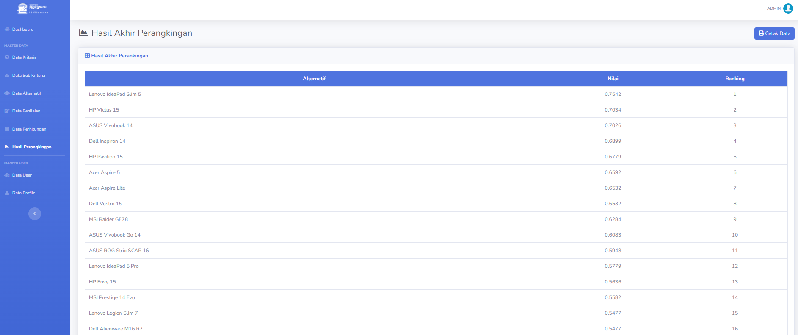

# 💻 SPK AHP–SAW: Sistem Rekomendasi Laptop untuk Kebutuhan Pemrograman

Aplikasi ini merupakan **Sistem Pendukung Keputusan (SPK)** berbasis web yang dirancang untuk membantu pengguna khususnya **mahasiswa, programmer, dan praktisi IT** dalam menentukan **laptop terbaik untuk kebutuhan pemrograman** secara objektif dan terukur.

Sistem ini mengadopsi pendekatan **data-driven decision making** dengan mengombinasikan dua metode ilmiah yang banyak digunakan dalam dunia industri dan akademik, yaitu **Analytical Hierarchy Process (AHP)** dan **Simple Additive Weighting (SAW)**.

> 📌 Proyek ini dikembangkan sebagai **Final Project Mata Kuliah Sistem Pendukung Keputusan** dan relevan sebagai portofolio awal di bidang **Decision Support System, Web Development, dan Data Analysis**.

---

## 🧠 Metode yang Digunakan

Sistem mengombinasikan dua metode SPK untuk menghasilkan rekomendasi yang **konsisten, transparan, dan dapat dipertanggungjawabkan**:

1. **Analytical Hierarchy Process (AHP)**
   Digunakan untuk menentukan **bobot kepentingan setiap kriteria** melalui proses *pairwise comparison*, menggunakan skala 1-9 Saaty. Sistem secara otomatis melakukan:

   * Normalisasi matriks perbandingan
   * Perhitungan bobot prioritas
   * **Uji konsistensi (Consistency Ratio / CR)** untuk memastikan validitas penilaian

2. **Simple Additive Weighting (SAW)**
   Digunakan untuk melakukan **perangkingan alternatif laptop** berdasarkan bobot dari AHP. Metode ini menghitung nilai preferensi akhir dari setiap alternatif sehingga diperoleh urutan rekomendasi terbaik.

---

## ⚙️ Alur Kerja Sistem

1. **Manajemen Data (CRUD)**

   * **Kriteria:** Harga, Processor, RAM, VGA, Storage, dan Baterai
   * **Sub-Kriteria & Skala:** Konversi spesifikasi laptop ke nilai numerik
   * **Alternatif:** Data laptop beserta spesifikasi teknis

2. **Pembobotan Kriteria (AHP)**

   * Pengguna mengisi matriks perbandingan berpasangan antar kriteria
   * Sistem menghitung bobot prioritas
   * Dilakukan **uji konsistensi (CR < 0,1)** sebelum bobot disimpan

3. **Penilaian Alternatif Laptop**

   * Setiap laptop dinilai berdasarkan kriteria yang telah ditentukan
   * Sistem menyediakan skala penilaian untuk meminimalkan subjektivitas

4. **Normalisasi & Perangkingan (SAW)**

   * **Matriks Keputusan (X):** berisi nilai awal hasil penilaian alternatif terhadap setiap kriteria.

   * **Normalisasi Matriks (R):** dilakukan agar nilai berada pada rentang 0–1 dengan rumus:

     **a. Kriteria Benefit**
     rᵢⱼ = xᵢⱼ / max(xᵢⱼ)

     **b. Kriteria Cost**
     rᵢⱼ = min(xᵢⱼ) / xᵢⱼ

     **Keterangan:**

     * xᵢⱼ : nilai alternatif ke-i pada kriteria ke-j (nilai awal hasil penilaian)
     * max(xᵢⱼ) : nilai maksimum dari seluruh alternatif pada kriteria ke-j
     * min(xᵢⱼ) : nilai minimum dari seluruh alternatif pada kriteria ke-j
     * rᵢⱼ : nilai hasil normalisasi

   * **Perhitungan Nilai Preferensi (Vᵢ):**
     Vᵢ = Σ (wⱼ × rᵢⱼ)

     dengan:

     * wⱼ : bobot kriteria ke-j hasil perhitungan AHP

   * **Perangkingan:** alternatif dengan nilai Vᵢ tertinggi merupakan rekomendasi terbaik.

---

## ✨ Fitur Utama

* 🔐 Autentikasi & Manajemen User
* 👤 Manajemen Profil Akun
* 📋 Manajemen Data Kriteria & Sub-Kriteria
* 💻 Manajemen Data Alternatif Laptop
* ⚖️ Perhitungan Bobot Kriteria (AHP)
* 🏆 Perangkingan Laptop (SAW)
* 📊 Tampilan Hasil Rekomendasi & Ranking

---

## 🛠️ Teknologi yang Digunakan

* **Backend:** PHP, CodeIgniter 4
* **Database:** MySQL / MariaDB
* **Frontend:** HTML, CSS, Bootstrap (SB Admin Template), jQuery
* **Server:** Apache (XAMPP / Laragon)

---

## 🚀 Instalasi & Konfigurasi

Ikuti langkah-langkah berikut untuk menjalankan aplikasi secara lokal:

1. **Clone Repository**

   ```bash
   git clone https://github.com/aismaanly/SPK-SAW-LAPTOP.git
   ```

2. **Pindahkan ke Direktori Server**
   Letakkan folder project ke dalam direktori web server:

   * `htdocs/` (XAMPP)
   * `www/` (Laragon)

3. **Konfigurasi Database**

   * Buat database baru (misal: `spk_laptop`)
   * Import file SQL yang tersedia pada folder `src/spk_laptop.sql`
   * Sesuaikan konfigurasi database pada file:

     ```
     application/config/database.php
     ```

4. **Jalankan Aplikasi**

   * Pastikan Apache dan MySQL sudah berjalan
   * Akses aplikasi melalui browser:

     ```
     http://localhost/SPK-SAW-LAPTOP
     ```

5. **Login ke Sistem**

   * Gunakan akun default yang tersedia di database
      * Username: admin
      * Password: admin   

---

## 🎯 Tujuan Pengembangan

* Membantu pengambilan keputusan pemilihan laptop secara objektif
* Mengurangi subjektivitas dalam menilai spesifikasi perangkat
* Mengimplementasikan metode AHP dan SAW dalam sistem nyata
* Menjadi **portofolio proyek SPK** yang relevan dengan kebutuhan industri

---

## ⭐ Preview


